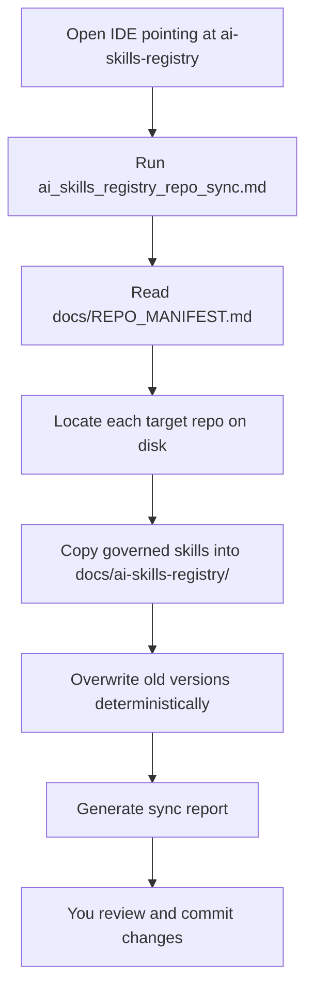

# Sync Protocol  
A clear, deterministic process for propagating governed skills from the AI Skills Registry into all managed repositories.

This document explains **how syncing works**, **how to run it**, and **how to troubleshoot issues**.

---

# 📘 Overview

The AI Skills Registry is the **source of truth** for all governed skills.  
Other repos (e.g., `familyWealthSystem`, `gardenApp`, `openAntigonish`) receive updates through a **manual sync operation** triggered by running a tool prompt.

Nothing syncs automatically.  
You stay in control.

---

# 🧩 Components Involved in Sync

### **1. The Sync Tool**
Located at:
```
prompts/tools/ai_skills_registry_repo_sync.md
```

This tool performs the actual propagation.

### **2. The Repo Manifest**
Located at:
```
docs/REPO_MANIFEST.md
```

This file defines:

- which repos receive updates  
- where they are located on disk  
- which folders to sync  
- optional overrides  

### **3. Governed Skills**
Located at:
```
docs/ai-skills-registry/prompts/skills/
```

These files are copied into `<repo-root>/docs/ai-skills-registry/prompts/skills/`.

---

# 🔄 Sync Flow (Mermaid Diagram)



---

# 🛠️ How to Run a Sync

### **1. Open Antigravity IDE, Jules, or Gemini**
Point it at the `ai-skills-registry` repo.

### **2. Run the sync tool**
Paste this into the chat:

```
Run ai_skills_registry_repo_sync.md.
```

### **3. The tool will:**
- Read the manifest  
- Validate repo paths  
- Copy governed skills into each repo  
- Overwrite old versions  
- Preserve repo‑specific prompts  
- Produce a summary of changes  

### **4. Review the diff**
Each target repo will show updated files.

### **5. Commit the changes**
This finalizes the sync.

---

# 📜 Manifest Rules

The manifest is a Markdown table located at:

```
docs/REPO_MANIFEST.md
```

### Required Columns
| Column | Purpose |
|--------|---------|
| **Repo Name** | Human‑readable name |
| **Path** | Local filesystem path to the repo |
| **Skills Synced** | Usually `all` |
| **Notes** | Optional context |

### Example
```markdown
| Repo Name | Path | Skills Synced | Notes |
|----------|------|----------------|-------|
| familyWealthSystem | ../familyWealthSystem | all | Production repo |
| gardenApp | ../gardenApp | all | UI-heavy repo |
| openAntigonish | ../openAntigonish | all | Civic data platform |
```

### Adding a New Repo
1. Add a new row to the table  
2. Ensure the path is correct  
3. Run the sync tool  

---

# 🧭 What Gets Synced

### **Synced**
- `prompts/skills/`  
- Any new governed skills  
- Updated governed skills  
- Deterministic formatting  

### **Not Synced**
- Repo‑specific prompts  
- Repo‑specific tools  
- Local overrides  
- Code files  
- Config files  

---

# 🧪 Testing the Sync

After running the sync:

1. Open each target repo  
2. Check `docs/ai-skills-registry/prompts/skills/`
3. Confirm files match the registry  
4. Run a governed skill from the new path to ensure it loads
5. Commit changes  

---

# 🩺 Troubleshooting

### **Repo not syncing**
- Check the path in `REPO_MANIFEST.md`  
- Ensure the repo exists locally  
- Ensure the IDE is pointed at the registry repo  

### **Skill missing in target repo**
- Ensure it exists in `prompts/skills/`  
- Ensure the manifest includes the repo  
- Re-run the sync tool  

### **Unexpected overwrites**
- Governed skills always overwrite deterministically  
- Repo‑specific prompts should live outside governed folders  

### **Agent not following a skill**
- Ensure the skill exists in the target repo  
- Ensure the agent is pointed at the correct repo  
- Ensure the skill file is not corrupted  

---

# 🧘 Philosophy

Syncing is:

- manual  
- intentional  
- deterministic  
- transparent  

You decide when governance updates propagate.  
The system never surprises you.

---

# End of Sync Protocol